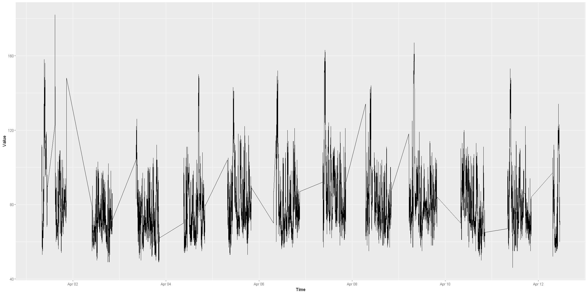
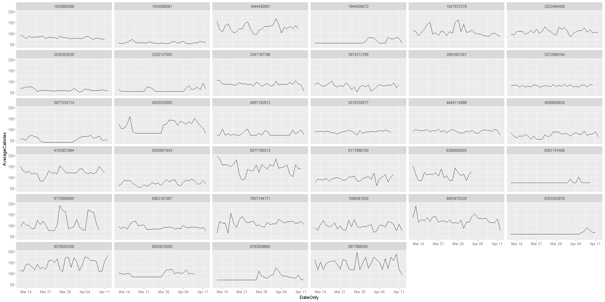
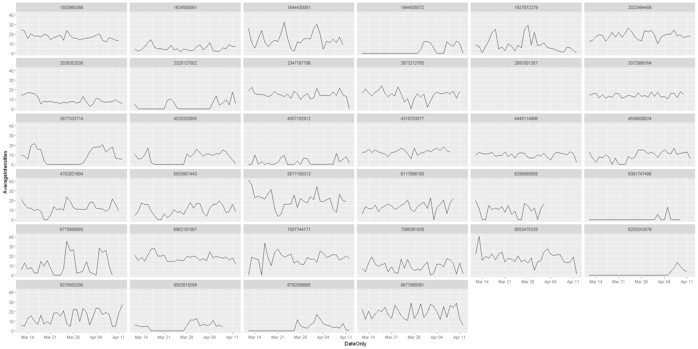
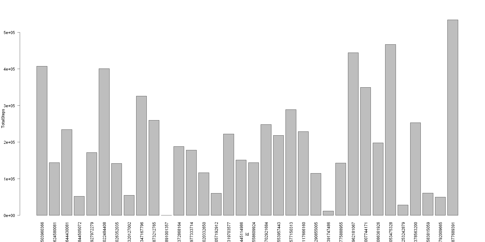
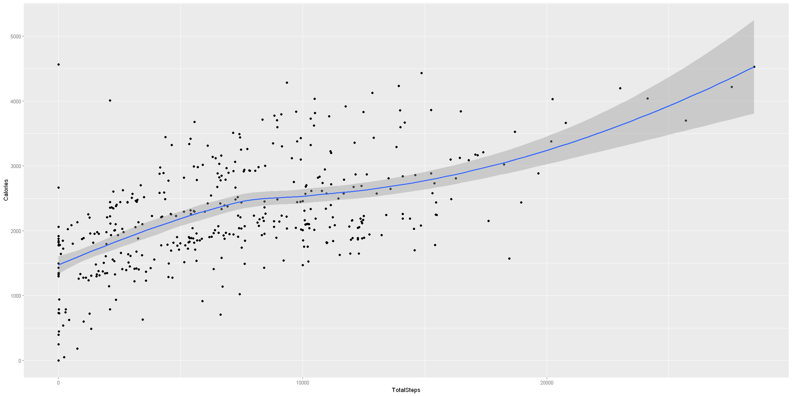
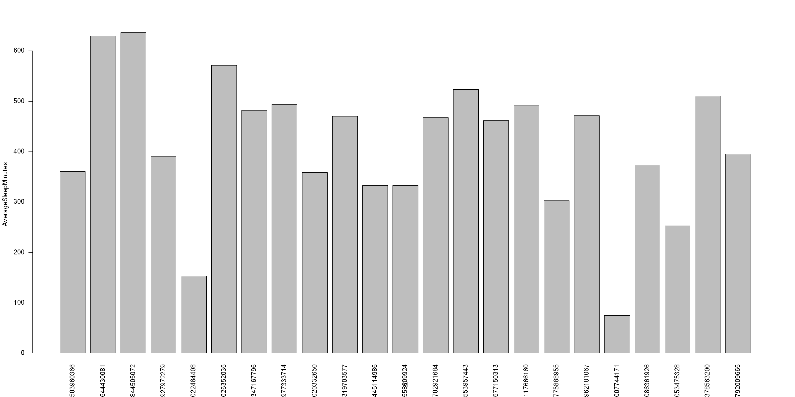

# Introduction

Bellabeat is a leading technology company specializing in health-focused products designed for women. We will examine the datasets associated with this company, sourced from Kaggle. We will review the datasets and also explore the selection of tools for our study, along with the rationale behind their choice.

# Preparations

We've retrieved the datasets from the provided link, which include two folders. Upon inspection, we noticed that both folders contain similar data. Therefore, we'll utilize only one of the folders to derive insights from the data. The useddataset is provided in the repository.

For the initial attempt, we attempted to load the dataset using MS Excel. However, due to its size exceeding the capacity of Excel's grid, we've decided to switch to the R programming language for conducting our data analysis.

# Importing the Libraries


```R
library(tidyverse)
library (hms)
```

    ── Attaching core tidyverse packages ──────────────────────────────────────────────────────────────── tidyverse 2.0.0 ──
    ✔ dplyr     1.1.4     ✔ readr     2.1.5
    ✔ forcats   1.0.0     ✔ stringr   1.5.1
    ✔ ggplot2   3.5.1     ✔ tibble    3.2.1
    ✔ lubridate 1.9.3     ✔ tidyr     1.3.1
    ✔ purrr     1.0.2     
    ── Conflicts ────────────────────────────────────────────────────────────────────────────────── tidyverse_conflicts() ──
    ✖ dplyr::filter() masks stats::filter()
    ✖ dplyr::lag()    masks stats::lag()
    ℹ Use the conflicted package (<http://conflicted.r-lib.org/>) to force all conflicts to become errors
    
    Attaching package: 'hms'
    
    
    The following object is masked from 'package:lubridate':
    
        hms
    
    
    

# Reading the CSV Files


```R
daily_activity <- read_csv("Fitabase Data 3.12.16-4.11.16/dailyActivity_merged.csv")
```

    Rows: 457 Columns: 15
    ── Column specification ────────────────────────────────────────────────────────────────────────────────────────────────
    Delimiter: ","
    chr  (1): ActivityDate
    dbl (14): Id, TotalSteps, TotalDistance, TrackerDistance, LoggedActivitiesDi...
    
    ℹ Use `spec()` to retrieve the full column specification for this data.
    ℹ Specify the column types or set `show_col_types = FALSE` to quiet this message.
    


```R
heart_rate_seconds <- read_csv("Fitabase Data 3.12.16-4.11.16/heartrate_seconds_merged.csv")
```

    Rows: 1154681 Columns: 3
    ── Column specification ────────────────────────────────────────────────────────────────────────────────────────────────
    Delimiter: ","
    chr (1): Time
    dbl (2): Id, Value
    
    ℹ Use `spec()` to retrieve the full column specification for this data.
    ℹ Specify the column types or set `show_col_types = FALSE` to quiet this message.
    


```R
hourly_calories <- read_csv("Fitabase Data 3.12.16-4.11.16/hourlyCalories_merged.csv")
```

    Rows: 24084 Columns: 3
    ── Column specification ────────────────────────────────────────────────────────────────────────────────────────────────
    Delimiter: ","
    chr (1): ActivityHour
    dbl (2): Id, Calories
    
    ℹ Use `spec()` to retrieve the full column specification for this data.
    ℹ Specify the column types or set `show_col_types = FALSE` to quiet this message.
    


```R
hourly_intensities <- read_csv("Fitabase Data 3.12.16-4.11.16/hourlyIntensities_merged.csv")
```

    Rows: 24084 Columns: 4
    ── Column specification ────────────────────────────────────────────────────────────────────────────────────────────────
    Delimiter: ","
    chr (1): ActivityHour
    dbl (3): Id, TotalIntensity, AverageIntensity
    
    ℹ Use `spec()` to retrieve the full column specification for this data.
    ℹ Specify the column types or set `show_col_types = FALSE` to quiet this message.
    


```R
hourly_steps <- read_csv("Fitabase Data 3.12.16-4.11.16/hourlySteps_merged.csv")
```

    Rows: 24084 Columns: 3
    ── Column specification ────────────────────────────────────────────────────────────────────────────────────────────────
    Delimiter: ","
    chr (1): ActivityHour
    dbl (2): Id, StepTotal
    
    ℹ Use `spec()` to retrieve the full column specification for this data.
    ℹ Specify the column types or set `show_col_types = FALSE` to quiet this message.
    


```R
sleep <- read_csv("Fitabase Data 3.12.16-4.11.16/minuteSleep_merged.csv")
```

    Rows: 198559 Columns: 4
    ── Column specification ────────────────────────────────────────────────────────────────────────────────────────────────
    Delimiter: ","
    chr (1): date
    dbl (3): Id, value, logId
    
    ℹ Use `spec()` to retrieve the full column specification for this data.
    ℹ Specify the column types or set `show_col_types = FALSE` to quiet this message.
    


```R
weight_info <- read_csv("Fitabase Data 3.12.16-4.11.16/weightLogInfo_merged.csv")
```

    Rows: 33 Columns: 8
    ── Column specification ────────────────────────────────────────────────────────────────────────────────────────────────
    Delimiter: ","
    chr (1): Date
    dbl (6): Id, WeightKg, WeightPounds, Fat, BMI, LogId
    lgl (1): IsManualReport
    
    ℹ Use `spec()` to retrieve the full column specification for this data.
    ℹ Specify the column types or set `show_col_types = FALSE` to quiet this message.
    

# Perviewing the Imported Datasets


```R
head(daily_activity)
sum(is.na(daily_activity)) # finds the count of missing values 
length(unique(daily_activity$Id)) # finds unique Ids in the data set
sum(duplicated(daily_activity))
```


<table class="dataframe">
<caption>A tibble: 6 × 15</caption>
<thead>
	<tr><th scope=col>Id</th><th scope=col>ActivityDate</th><th scope=col>TotalSteps</th><th scope=col>TotalDistance</th><th scope=col>TrackerDistance</th><th scope=col>LoggedActivitiesDistance</th><th scope=col>VeryActiveDistance</th><th scope=col>ModeratelyActiveDistance</th><th scope=col>LightActiveDistance</th><th scope=col>SedentaryActiveDistance</th><th scope=col>VeryActiveMinutes</th><th scope=col>FairlyActiveMinutes</th><th scope=col>LightlyActiveMinutes</th><th scope=col>SedentaryMinutes</th><th scope=col>Calories</th></tr>
	<tr><th scope=col>&lt;dbl&gt;</th><th scope=col>&lt;chr&gt;</th><th scope=col>&lt;dbl&gt;</th><th scope=col>&lt;dbl&gt;</th><th scope=col>&lt;dbl&gt;</th><th scope=col>&lt;dbl&gt;</th><th scope=col>&lt;dbl&gt;</th><th scope=col>&lt;dbl&gt;</th><th scope=col>&lt;dbl&gt;</th><th scope=col>&lt;dbl&gt;</th><th scope=col>&lt;dbl&gt;</th><th scope=col>&lt;dbl&gt;</th><th scope=col>&lt;dbl&gt;</th><th scope=col>&lt;dbl&gt;</th><th scope=col>&lt;dbl&gt;</th></tr>
</thead>
<tbody>
	<tr><td>1503960366</td><td>3/25/2016</td><td>11004</td><td> 7.11</td><td> 7.11</td><td>0</td><td>2.57</td><td>0.46</td><td>4.07</td><td>0</td><td>33</td><td>12</td><td>205</td><td> 804</td><td>1819</td></tr>
	<tr><td>1503960366</td><td>3/26/2016</td><td>17609</td><td>11.55</td><td>11.55</td><td>0</td><td>6.92</td><td>0.73</td><td>3.91</td><td>0</td><td>89</td><td>17</td><td>274</td><td> 588</td><td>2154</td></tr>
	<tr><td>1503960366</td><td>3/27/2016</td><td>12736</td><td> 8.53</td><td> 8.53</td><td>0</td><td>4.66</td><td>0.16</td><td>3.71</td><td>0</td><td>56</td><td> 5</td><td>268</td><td> 605</td><td>1944</td></tr>
	<tr><td>1503960366</td><td>3/28/2016</td><td>13231</td><td> 8.93</td><td> 8.93</td><td>0</td><td>3.19</td><td>0.79</td><td>4.95</td><td>0</td><td>39</td><td>20</td><td>224</td><td>1080</td><td>1932</td></tr>
	<tr><td>1503960366</td><td>3/29/2016</td><td>12041</td><td> 7.85</td><td> 7.85</td><td>0</td><td>2.16</td><td>1.09</td><td>4.61</td><td>0</td><td>28</td><td>28</td><td>243</td><td> 763</td><td>1886</td></tr>
	<tr><td>1503960366</td><td>3/30/2016</td><td>10970</td><td> 7.16</td><td> 7.16</td><td>0</td><td>2.36</td><td>0.51</td><td>4.29</td><td>0</td><td>30</td><td>13</td><td>223</td><td>1174</td><td>1820</td></tr>
</tbody>
</table>


0


35


0


```R
head(heart_rate_seconds)
sum(is.na(heart_rate_seconds))
length(unique(heart_rate_seconds$Id))
sum(duplicated(heart_rate_seconds))
```


<table class="dataframe">
<caption>A tibble: 6 × 3</caption>
<thead>
	<tr><th scope=col>Id</th><th scope=col>Time</th><th scope=col>Value</th></tr>
	<tr><th scope=col>&lt;dbl&gt;</th><th scope=col>&lt;chr&gt;</th><th scope=col>&lt;dbl&gt;</th></tr>
</thead>
<tbody>
	<tr><td>2022484408</td><td>4/1/2016 7:54:00 AM</td><td> 93</td></tr>
	<tr><td>2022484408</td><td>4/1/2016 7:54:05 AM</td><td> 91</td></tr>
	<tr><td>2022484408</td><td>4/1/2016 7:54:10 AM</td><td> 96</td></tr>
	<tr><td>2022484408</td><td>4/1/2016 7:54:15 AM</td><td> 98</td></tr>
	<tr><td>2022484408</td><td>4/1/2016 7:54:20 AM</td><td>100</td></tr>
	<tr><td>2022484408</td><td>4/1/2016 7:54:25 AM</td><td>101</td></tr>
</tbody>
</table>


0


14


0


```R
head(hourly_calories)
sum(is.na(hourly_calories))
length(unique(hourly_calories$Id))
sum(duplicated(hourly_calories))
```


<table class="dataframe">
<caption>A tibble: 6 × 3</caption>
<thead>
	<tr><th scope=col>Id</th><th scope=col>ActivityHour</th><th scope=col>Calories</th></tr>
	<tr><th scope=col>&lt;dbl&gt;</th><th scope=col>&lt;chr&gt;</th><th scope=col>&lt;dbl&gt;</th></tr>
</thead>
<tbody>
	<tr><td>1503960366</td><td>3/12/2016 12:00:00 AM</td><td>48</td></tr>
	<tr><td>1503960366</td><td>3/12/2016 1:00:00 AM </td><td>48</td></tr>
	<tr><td>1503960366</td><td>3/12/2016 2:00:00 AM </td><td>48</td></tr>
	<tr><td>1503960366</td><td>3/12/2016 3:00:00 AM </td><td>48</td></tr>
	<tr><td>1503960366</td><td>3/12/2016 4:00:00 AM </td><td>48</td></tr>
	<tr><td>1503960366</td><td>3/12/2016 5:00:00 AM </td><td>48</td></tr>
</tbody>
</table>


0


34


0


```R
head(hourly_intensities)
sum(is.na(hourly_intensities))
length(unique(hourly_intensities$Id))
sum(duplicated(hourly_intensities))
```


<table class="dataframe">
<caption>A tibble: 6 × 4</caption>
<thead>
	<tr><th scope=col>Id</th><th scope=col>ActivityHour</th><th scope=col>TotalIntensity</th><th scope=col>AverageIntensity</th></tr>
	<tr><th scope=col>&lt;dbl&gt;</th><th scope=col>&lt;chr&gt;</th><th scope=col>&lt;dbl&gt;</th><th scope=col>&lt;dbl&gt;</th></tr>
</thead>
<tbody>
	<tr><td>1503960366</td><td>3/12/2016 12:00:00 AM</td><td>0</td><td>0</td></tr>
	<tr><td>1503960366</td><td>3/12/2016 1:00:00 AM </td><td>0</td><td>0</td></tr>
	<tr><td>1503960366</td><td>3/12/2016 2:00:00 AM </td><td>0</td><td>0</td></tr>
	<tr><td>1503960366</td><td>3/12/2016 3:00:00 AM </td><td>0</td><td>0</td></tr>
	<tr><td>1503960366</td><td>3/12/2016 4:00:00 AM </td><td>0</td><td>0</td></tr>
	<tr><td>1503960366</td><td>3/12/2016 5:00:00 AM </td><td>0</td><td>0</td></tr>
</tbody>
</table>


0


34


0


```R
head(hourly_steps)
sum(is.na(hourly_steps))
length(unique(hourly_steps$Id))
sum(duplicated(hourly_steps))
```


<table class="dataframe">
<caption>A tibble: 6 × 3</caption>
<thead>
	<tr><th scope=col>Id</th><th scope=col>ActivityHour</th><th scope=col>StepTotal</th></tr>
	<tr><th scope=col>&lt;dbl&gt;</th><th scope=col>&lt;chr&gt;</th><th scope=col>&lt;dbl&gt;</th></tr>
</thead>
<tbody>
	<tr><td>1503960366</td><td>3/12/2016 12:00:00 AM</td><td>0</td></tr>
	<tr><td>1503960366</td><td>3/12/2016 1:00:00 AM </td><td>0</td></tr>
	<tr><td>1503960366</td><td>3/12/2016 2:00:00 AM </td><td>0</td></tr>
	<tr><td>1503960366</td><td>3/12/2016 3:00:00 AM </td><td>0</td></tr>
	<tr><td>1503960366</td><td>3/12/2016 4:00:00 AM </td><td>0</td></tr>
	<tr><td>1503960366</td><td>3/12/2016 5:00:00 AM </td><td>0</td></tr>
</tbody>
</table>


0


34


0


```R
head(sleep)
sum(is.na(sleep))
length(unique(sleep$Id))
sum(duplicated(sleep)) # number of duplicates
sleep <- unique(sleep) # removing duplicate rows
sum(duplicated(sleep)) # to verify that duplicates have been removed or not
```


<table class="dataframe">
<caption>A tibble: 6 × 4</caption>
<thead>
	<tr><th scope=col>Id</th><th scope=col>date</th><th scope=col>value</th><th scope=col>logId</th></tr>
	<tr><th scope=col>&lt;dbl&gt;</th><th scope=col>&lt;chr&gt;</th><th scope=col>&lt;dbl&gt;</th><th scope=col>&lt;dbl&gt;</th></tr>
</thead>
<tbody>
	<tr><td>1503960366</td><td>3/13/2016 2:39:30 AM</td><td>1</td><td>11114919637</td></tr>
	<tr><td>1503960366</td><td>3/13/2016 2:40:30 AM</td><td>1</td><td>11114919637</td></tr>
	<tr><td>1503960366</td><td>3/13/2016 2:41:30 AM</td><td>1</td><td>11114919637</td></tr>
	<tr><td>1503960366</td><td>3/13/2016 2:42:30 AM</td><td>1</td><td>11114919637</td></tr>
	<tr><td>1503960366</td><td>3/13/2016 2:43:30 AM</td><td>1</td><td>11114919637</td></tr>
	<tr><td>1503960366</td><td>3/13/2016 2:44:30 AM</td><td>1</td><td>11114919637</td></tr>
</tbody>
</table>


0


23


525


0


```R
head(weight_info)
sum(is.na(weight_info))
length(unique(weight_info$Id))
sum(duplicated(weight_info))
```


<table class="dataframe">
<caption>A tibble: 6 × 8</caption>
<thead>
	<tr><th scope=col>Id</th><th scope=col>Date</th><th scope=col>WeightKg</th><th scope=col>WeightPounds</th><th scope=col>Fat</th><th scope=col>BMI</th><th scope=col>IsManualReport</th><th scope=col>LogId</th></tr>
	<tr><th scope=col>&lt;dbl&gt;</th><th scope=col>&lt;chr&gt;</th><th scope=col>&lt;dbl&gt;</th><th scope=col>&lt;dbl&gt;</th><th scope=col>&lt;dbl&gt;</th><th scope=col>&lt;dbl&gt;</th><th scope=col>&lt;lgl&gt;</th><th scope=col>&lt;dbl&gt;</th></tr>
</thead>
<tbody>
	<tr><td>1503960366</td><td>4/5/2016 11:59:59 PM</td><td> 53.3</td><td>117.5064</td><td>22</td><td>22.97</td><td> TRUE</td><td>1.459901e+12</td></tr>
	<tr><td>1927972279</td><td>4/10/2016 6:33:26 PM</td><td>129.6</td><td>285.7191</td><td>NA</td><td>46.17</td><td>FALSE</td><td>1.460313e+12</td></tr>
	<tr><td>2347167796</td><td>4/3/2016 11:59:59 PM</td><td> 63.4</td><td>139.7731</td><td>10</td><td>24.77</td><td> TRUE</td><td>1.459728e+12</td></tr>
	<tr><td>2873212765</td><td>4/6/2016 11:59:59 PM</td><td> 56.7</td><td>125.0021</td><td>NA</td><td>21.45</td><td> TRUE</td><td>1.459987e+12</td></tr>
	<tr><td>2873212765</td><td>4/7/2016 11:59:59 PM</td><td> 57.2</td><td>126.1044</td><td>NA</td><td>21.65</td><td> TRUE</td><td>1.460074e+12</td></tr>
	<tr><td>2891001357</td><td>4/5/2016 11:59:59 PM</td><td> 88.4</td><td>194.8886</td><td>NA</td><td>25.03</td><td> TRUE</td><td>1.459901e+12</td></tr>
</tbody>
</table>


31


11


0


After the previewing of datasets, we conclude the followings:
- There are no missing values in selected data sets except the weight_info data frame
- The datasets are inconsistent as number of participants in each dataset is not same (Id column)
- A transformation is required for time/date column
- Duplicates were identified in the sleep data frame which are removed.

# Transformation of Date/Time
the date/time column for all datasets is character datatype. We will convert it into date/time data type in R


```R
daily_activity$ActivityDate <- mdy(daily_activity$ActivityDate)
```


```R
head(daily_activity)
```


<table class="dataframe">
<caption>A tibble: 6 × 15</caption>
<thead>
	<tr><th scope=col>Id</th><th scope=col>ActivityDate</th><th scope=col>TotalSteps</th><th scope=col>TotalDistance</th><th scope=col>TrackerDistance</th><th scope=col>LoggedActivitiesDistance</th><th scope=col>VeryActiveDistance</th><th scope=col>ModeratelyActiveDistance</th><th scope=col>LightActiveDistance</th><th scope=col>SedentaryActiveDistance</th><th scope=col>VeryActiveMinutes</th><th scope=col>FairlyActiveMinutes</th><th scope=col>LightlyActiveMinutes</th><th scope=col>SedentaryMinutes</th><th scope=col>Calories</th></tr>
	<tr><th scope=col>&lt;dbl&gt;</th><th scope=col>&lt;date&gt;</th><th scope=col>&lt;dbl&gt;</th><th scope=col>&lt;dbl&gt;</th><th scope=col>&lt;dbl&gt;</th><th scope=col>&lt;dbl&gt;</th><th scope=col>&lt;dbl&gt;</th><th scope=col>&lt;dbl&gt;</th><th scope=col>&lt;dbl&gt;</th><th scope=col>&lt;dbl&gt;</th><th scope=col>&lt;dbl&gt;</th><th scope=col>&lt;dbl&gt;</th><th scope=col>&lt;dbl&gt;</th><th scope=col>&lt;dbl&gt;</th><th scope=col>&lt;dbl&gt;</th></tr>
</thead>
<tbody>
	<tr><td>1503960366</td><td>2016-03-25</td><td>11004</td><td> 7.11</td><td> 7.11</td><td>0</td><td>2.57</td><td>0.46</td><td>4.07</td><td>0</td><td>33</td><td>12</td><td>205</td><td> 804</td><td>1819</td></tr>
	<tr><td>1503960366</td><td>2016-03-26</td><td>17609</td><td>11.55</td><td>11.55</td><td>0</td><td>6.92</td><td>0.73</td><td>3.91</td><td>0</td><td>89</td><td>17</td><td>274</td><td> 588</td><td>2154</td></tr>
	<tr><td>1503960366</td><td>2016-03-27</td><td>12736</td><td> 8.53</td><td> 8.53</td><td>0</td><td>4.66</td><td>0.16</td><td>3.71</td><td>0</td><td>56</td><td> 5</td><td>268</td><td> 605</td><td>1944</td></tr>
	<tr><td>1503960366</td><td>2016-03-28</td><td>13231</td><td> 8.93</td><td> 8.93</td><td>0</td><td>3.19</td><td>0.79</td><td>4.95</td><td>0</td><td>39</td><td>20</td><td>224</td><td>1080</td><td>1932</td></tr>
	<tr><td>1503960366</td><td>2016-03-29</td><td>12041</td><td> 7.85</td><td> 7.85</td><td>0</td><td>2.16</td><td>1.09</td><td>4.61</td><td>0</td><td>28</td><td>28</td><td>243</td><td> 763</td><td>1886</td></tr>
	<tr><td>1503960366</td><td>2016-03-30</td><td>10970</td><td> 7.16</td><td> 7.16</td><td>0</td><td>2.36</td><td>0.51</td><td>4.29</td><td>0</td><td>30</td><td>13</td><td>223</td><td>1174</td><td>1820</td></tr>
</tbody>
</table>


```R
heart_rate_seconds$Time <- mdy_hms(heart_rate_seconds$Time,tz = Sys.timezone())
```


```R
head(heart_rate_seconds)
```


<table class="dataframe">
<caption>A tibble: 6 × 3</caption>
<thead>
	<tr><th scope=col>Id</th><th scope=col>Time</th><th scope=col>Value</th></tr>
	<tr><th scope=col>&lt;dbl&gt;</th><th scope=col>&lt;dttm&gt;</th><th scope=col>&lt;dbl&gt;</th></tr>
</thead>
<tbody>
	<tr><td>2022484408</td><td>2016-04-01 07:54:00</td><td> 93</td></tr>
	<tr><td>2022484408</td><td>2016-04-01 07:54:05</td><td> 91</td></tr>
	<tr><td>2022484408</td><td>2016-04-01 07:54:10</td><td> 96</td></tr>
	<tr><td>2022484408</td><td>2016-04-01 07:54:15</td><td> 98</td></tr>
	<tr><td>2022484408</td><td>2016-04-01 07:54:20</td><td>100</td></tr>
	<tr><td>2022484408</td><td>2016-04-01 07:54:25</td><td>101</td></tr>
</tbody>
</table>


```R
hourly_calories$ActivityHour <- mdy_hms(hourly_calories$ActivityHour, tz = Sys.timezone())
```


```R
head(hourly_calories)
```


<table class="dataframe">
<caption>A tibble: 6 × 3</caption>
<thead>
	<tr><th scope=col>Id</th><th scope=col>ActivityHour</th><th scope=col>Calories</th></tr>
	<tr><th scope=col>&lt;dbl&gt;</th><th scope=col>&lt;dttm&gt;</th><th scope=col>&lt;dbl&gt;</th></tr>
</thead>
<tbody>
	<tr><td>1503960366</td><td>2016-03-12 00:00:00</td><td>48</td></tr>
	<tr><td>1503960366</td><td>2016-03-12 01:00:00</td><td>48</td></tr>
	<tr><td>1503960366</td><td>2016-03-12 02:00:00</td><td>48</td></tr>
	<tr><td>1503960366</td><td>2016-03-12 03:00:00</td><td>48</td></tr>
	<tr><td>1503960366</td><td>2016-03-12 04:00:00</td><td>48</td></tr>
	<tr><td>1503960366</td><td>2016-03-12 05:00:00</td><td>48</td></tr>
</tbody>
</table>


```R
hourly_intensities$ActivityHour <- mdy_hms(hourly_intensities$ActivityHour, tz = Sys.timezone())
```


```R
head(hourly_intensities)
```


<table class="dataframe">
<caption>A tibble: 6 × 4</caption>
<thead>
	<tr><th scope=col>Id</th><th scope=col>ActivityHour</th><th scope=col>TotalIntensity</th><th scope=col>AverageIntensity</th></tr>
	<tr><th scope=col>&lt;dbl&gt;</th><th scope=col>&lt;dttm&gt;</th><th scope=col>&lt;dbl&gt;</th><th scope=col>&lt;dbl&gt;</th></tr>
</thead>
<tbody>
	<tr><td>1503960366</td><td>2016-03-12 00:00:00</td><td>0</td><td>0</td></tr>
	<tr><td>1503960366</td><td>2016-03-12 01:00:00</td><td>0</td><td>0</td></tr>
	<tr><td>1503960366</td><td>2016-03-12 02:00:00</td><td>0</td><td>0</td></tr>
	<tr><td>1503960366</td><td>2016-03-12 03:00:00</td><td>0</td><td>0</td></tr>
	<tr><td>1503960366</td><td>2016-03-12 04:00:00</td><td>0</td><td>0</td></tr>
	<tr><td>1503960366</td><td>2016-03-12 05:00:00</td><td>0</td><td>0</td></tr>
</tbody>
</table>


```R
hourly_steps$ActivityHour <- mdy_hms(hourly_steps$ActivityHour, tz = Sys.timezone())
```


```R
head(hourly_steps)
```


<table class="dataframe">
<caption>A tibble: 6 × 3</caption>
<thead>
	<tr><th scope=col>Id</th><th scope=col>ActivityHour</th><th scope=col>StepTotal</th></tr>
	<tr><th scope=col>&lt;dbl&gt;</th><th scope=col>&lt;dttm&gt;</th><th scope=col>&lt;dbl&gt;</th></tr>
</thead>
<tbody>
	<tr><td>1503960366</td><td>2016-03-12 00:00:00</td><td>0</td></tr>
	<tr><td>1503960366</td><td>2016-03-12 01:00:00</td><td>0</td></tr>
	<tr><td>1503960366</td><td>2016-03-12 02:00:00</td><td>0</td></tr>
	<tr><td>1503960366</td><td>2016-03-12 03:00:00</td><td>0</td></tr>
	<tr><td>1503960366</td><td>2016-03-12 04:00:00</td><td>0</td></tr>
	<tr><td>1503960366</td><td>2016-03-12 05:00:00</td><td>0</td></tr>
</tbody>
</table>


```R
sleep$date <- mdy_hms(sleep$date, tz = Sys.timezone())
```


```R
head(sleep)
```


<table class="dataframe">
<caption>A tibble: 6 × 4</caption>
<thead>
	<tr><th scope=col>Id</th><th scope=col>date</th><th scope=col>value</th><th scope=col>logId</th></tr>
	<tr><th scope=col>&lt;dbl&gt;</th><th scope=col>&lt;dttm&gt;</th><th scope=col>&lt;dbl&gt;</th><th scope=col>&lt;dbl&gt;</th></tr>
</thead>
<tbody>
	<tr><td>1503960366</td><td>2016-03-13 02:39:30</td><td>1</td><td>11114919637</td></tr>
	<tr><td>1503960366</td><td>2016-03-13 02:40:30</td><td>1</td><td>11114919637</td></tr>
	<tr><td>1503960366</td><td>2016-03-13 02:41:30</td><td>1</td><td>11114919637</td></tr>
	<tr><td>1503960366</td><td>2016-03-13 02:42:30</td><td>1</td><td>11114919637</td></tr>
	<tr><td>1503960366</td><td>2016-03-13 02:43:30</td><td>1</td><td>11114919637</td></tr>
	<tr><td>1503960366</td><td>2016-03-13 02:44:30</td><td>1</td><td>11114919637</td></tr>
</tbody>
</table>


```R
weight_info$Date <- mdy_hms(weight_info$Date, tz = Sys.timezone())
```


```R
head(weight_info)
```


<table class="dataframe">
<caption>A tibble: 6 × 8</caption>
<thead>
	<tr><th scope=col>Id</th><th scope=col>Date</th><th scope=col>WeightKg</th><th scope=col>WeightPounds</th><th scope=col>Fat</th><th scope=col>BMI</th><th scope=col>IsManualReport</th><th scope=col>LogId</th></tr>
	<tr><th scope=col>&lt;dbl&gt;</th><th scope=col>&lt;dttm&gt;</th><th scope=col>&lt;dbl&gt;</th><th scope=col>&lt;dbl&gt;</th><th scope=col>&lt;dbl&gt;</th><th scope=col>&lt;dbl&gt;</th><th scope=col>&lt;lgl&gt;</th><th scope=col>&lt;dbl&gt;</th></tr>
</thead>
<tbody>
	<tr><td>1503960366</td><td>2016-04-05 23:59:59</td><td> 53.3</td><td>117.5064</td><td>22</td><td>22.97</td><td> TRUE</td><td>1.459901e+12</td></tr>
	<tr><td>1927972279</td><td>2016-04-10 18:33:26</td><td>129.6</td><td>285.7191</td><td>NA</td><td>46.17</td><td>FALSE</td><td>1.460313e+12</td></tr>
	<tr><td>2347167796</td><td>2016-04-03 23:59:59</td><td> 63.4</td><td>139.7731</td><td>10</td><td>24.77</td><td> TRUE</td><td>1.459728e+12</td></tr>
	<tr><td>2873212765</td><td>2016-04-06 23:59:59</td><td> 56.7</td><td>125.0021</td><td>NA</td><td>21.45</td><td> TRUE</td><td>1.459987e+12</td></tr>
	<tr><td>2873212765</td><td>2016-04-07 23:59:59</td><td> 57.2</td><td>126.1044</td><td>NA</td><td>21.65</td><td> TRUE</td><td>1.460074e+12</td></tr>
	<tr><td>2891001357</td><td>2016-04-05 23:59:59</td><td> 88.4</td><td>194.8886</td><td>NA</td><td>25.03</td><td> TRUE</td><td>1.459901e+12</td></tr>
</tbody>
</table>


# Analysis
we will uncover the general statistics of data and compare the results with appropriate data.


```R
daily_activity %>%
    select(FairlyActiveMinutes) %>%
    summary()

```


     FairlyActiveMinutes
     Min.   :  0.00     
     1st Qu.:  0.00     
     Median :  1.00     
     Mean   : 13.07     
     3rd Qu.: 16.00     
     Max.   :660.00     


The average of FairlyActiveMinutes is 13.07 in a day while WHO recommends at least 21 to 42 minutes of moderate aerobic activity per day \
Reference : https://www.who.int/europe/publications/i/item/9789240014886

Now we examine FairlyActiveMinutes for each respondant.


```R
daily_activity %>%
    group_by (Id) %>%
    summarise(Average_FairlyActiveMinutes = mean(FairlyActiveMinutes)) %>%
    filter (Average_FairlyActiveMinutes >= 21) %>% # 21 minutes are minimum moderate aerobic activity per day
    nrow()
```


8


### Recommendation-1 
It is important to mention that only 8 (23 %) respondents out of 35 are involved physical activity as per WHO guidelines.\
Also this information holds potential for enhancing Bellabeat's marketing strategy by encouraging customers toward increased activity over sedentary behavior. Moreover, the Bellabeat app could utilize timed notifications to prompt users towards activity rather than remaining sedentary.


```R
daily_activity %>%
    select (TotalSteps) %>%
    summary()
```


       TotalSteps   
     Min.   :    0  
     1st Qu.: 1988  
     Median : 5986  
     Mean   : 6547  
     3rd Qu.:10198  
     Max.   :28497  


According to a study, 10,000 steps per day is a reasonable target for healthy adults.\
Reference : https://www.healthline.com/health/how-many-steps-a-day#how-many-steps-per-day \
The mean fo TotalSteps for all respondents is 6547 which is quite low. \
### Recommendation-2
Bellabeat could utilize this data to incentivize customers who achieve the 10,000-step target with rewards. This initiative could create mutual benefits for both Bellabeat and its customers, fostering a win-win scenario.


```R
daily_activity %>%
    select (VeryActiveMinutes,FairlyActiveMinutes,LightlyActiveMinutes) %>%
    summary()
```


     VeryActiveMinutes FairlyActiveMinutes LightlyActiveMinutes
     Min.   :  0.00    Min.   :  0.00      Min.   :  0.0       
     1st Qu.:  0.00    1st Qu.:  0.00      1st Qu.: 64.0       
     Median :  0.00    Median :  1.00      Median :181.0       
     Mean   : 16.62    Mean   : 13.07      Mean   :170.1       
     3rd Qu.: 25.00    3rd Qu.: 16.00      3rd Qu.:257.0       
     Max.   :202.00    Max.   :660.00      Max.   :720.0       


The calculation above clearly indicates that responders lean towards a less active lifestyle


```R
options(repr.plot.width = 20, repr.plot.height =10)
heart_rate_seconds %>%
    filter (Id == 2022484408) %>%
    ggplot()+
    geom_line(mapping = aes(x = Time, y = Value))
```


    

    


### Recommendation-3
The data displays heart rate measurements over time, which can be made accessible through the Bellabeat app. This information may prompt users to be more mindful of their cardiac health.


```R
# We want to calculte average calories consumed by each respondent in a day.
# for this, we need DateOnly Column so that we can make use of group_by function
hourly_calories <- hourly_calories %>%
    mutate(TimeOnly = as_hms(hourly_calories$ActivityHour),DateOnly = as_date(hourly_calories$ActivityHour))
```


```R
head(hourly_calories)
```


<table class="dataframe">
<caption>A tibble: 6 × 5</caption>
<thead>
	<tr><th scope=col>Id</th><th scope=col>ActivityHour</th><th scope=col>Calories</th><th scope=col>TimeOnly</th><th scope=col>DateOnly</th></tr>
	<tr><th scope=col>&lt;dbl&gt;</th><th scope=col>&lt;dttm&gt;</th><th scope=col>&lt;dbl&gt;</th><th scope=col>&lt;time&gt;</th><th scope=col>&lt;date&gt;</th></tr>
</thead>
<tbody>
	<tr><td>1503960366</td><td>2016-03-12 00:00:00</td><td>48</td><td>00:00:00</td><td>2016-03-12</td></tr>
	<tr><td>1503960366</td><td>2016-03-12 01:00:00</td><td>48</td><td>01:00:00</td><td>2016-03-12</td></tr>
	<tr><td>1503960366</td><td>2016-03-12 02:00:00</td><td>48</td><td>02:00:00</td><td>2016-03-12</td></tr>
	<tr><td>1503960366</td><td>2016-03-12 03:00:00</td><td>48</td><td>03:00:00</td><td>2016-03-12</td></tr>
	<tr><td>1503960366</td><td>2016-03-12 04:00:00</td><td>48</td><td>04:00:00</td><td>2016-03-12</td></tr>
	<tr><td>1503960366</td><td>2016-03-12 05:00:00</td><td>48</td><td>05:00:00</td><td>2016-03-12</td></tr>
</tbody>
</table>


```R
calories_summary <- hourly_calories %>%
    group_by (Id,DateOnly) %>%
    summarise (AverageCalories = mean(Calories))
```

    `summarise()` has grouped output by 'Id'. You can override using the `.groups` argument.
    


```R
head(calories_summary)
```


<table class="dataframe">
<caption>A grouped_df: 6 × 3</caption>
<thead>
	<tr><th scope=col>Id</th><th scope=col>DateOnly</th><th scope=col>AverageCalories</th></tr>
	<tr><th scope=col>&lt;dbl&gt;</th><th scope=col>&lt;date&gt;</th><th scope=col>&lt;dbl&gt;</th></tr>
</thead>
<tbody>
	<tr><td>1503960366</td><td>2016-03-12</td><td>92.83333</td></tr>
	<tr><td>1503960366</td><td>2016-03-13</td><td>87.50000</td></tr>
	<tr><td>1503960366</td><td>2016-03-14</td><td>76.25000</td></tr>
	<tr><td>1503960366</td><td>2016-03-15</td><td>87.95833</td></tr>
	<tr><td>1503960366</td><td>2016-03-16</td><td>81.95833</td></tr>
	<tr><td>1503960366</td><td>2016-03-17</td><td>84.95833</td></tr>
</tbody>
</table>


```R
ggplot(data = calories_summary) +
    geom_line (mapping = aes(x = DateOnly, y = AverageCalories))+
    facet_wrap (~Id)
```

    `geom_line()`: Each group consists of only one observation.
    ℹ Do you need to adjust the group aesthetic?
    


    

    


### Recommendation-4
The graph above, representing individual responders, can serve as a tool for tracking calories within the Bellabeat App. This enables users to manage their lifestyle based on past records


```R
hourly_intensities <- hourly_intensities %>%
    mutate(TimeOnly = as_hms(hourly_intensities$ActivityHour),DateOnly = as_date(hourly_intensities$ActivityHour))
```


```R
head(hourly_intensities)
```


<table class="dataframe">
<caption>A tibble: 6 × 6</caption>
<thead>
	<tr><th scope=col>Id</th><th scope=col>ActivityHour</th><th scope=col>TotalIntensity</th><th scope=col>AverageIntensity</th><th scope=col>TimeOnly</th><th scope=col>DateOnly</th></tr>
	<tr><th scope=col>&lt;dbl&gt;</th><th scope=col>&lt;dttm&gt;</th><th scope=col>&lt;dbl&gt;</th><th scope=col>&lt;dbl&gt;</th><th scope=col>&lt;time&gt;</th><th scope=col>&lt;date&gt;</th></tr>
</thead>
<tbody>
	<tr><td>1503960366</td><td>2016-03-12 00:00:00</td><td>0</td><td>0</td><td>00:00:00</td><td>2016-03-12</td></tr>
	<tr><td>1503960366</td><td>2016-03-12 01:00:00</td><td>0</td><td>0</td><td>01:00:00</td><td>2016-03-12</td></tr>
	<tr><td>1503960366</td><td>2016-03-12 02:00:00</td><td>0</td><td>0</td><td>02:00:00</td><td>2016-03-12</td></tr>
	<tr><td>1503960366</td><td>2016-03-12 03:00:00</td><td>0</td><td>0</td><td>03:00:00</td><td>2016-03-12</td></tr>
	<tr><td>1503960366</td><td>2016-03-12 04:00:00</td><td>0</td><td>0</td><td>04:00:00</td><td>2016-03-12</td></tr>
	<tr><td>1503960366</td><td>2016-03-12 05:00:00</td><td>0</td><td>0</td><td>05:00:00</td><td>2016-03-12</td></tr>
</tbody>
</table>


```R
intensities_summary <- hourly_intensities %>%
    group_by (Id,DateOnly) %>%
    summarise (AverageIntensities = mean(TotalIntensity))
```

    `summarise()` has grouped output by 'Id'. You can override using the `.groups` argument.
    


```R
ggplot(data = intensities_summary) +
    geom_line (mapping = aes(x = DateOnly, y = AverageIntensities))+
    facet_wrap (~Id)
```

    `geom_line()`: Each group consists of only one observation.
    ℹ Do you need to adjust the group aesthetic?
    


    

    


### Recommendation-5
The graph above can serve as a tool for tracking intensities within the Bellabeat App. This enables users to manage their lifestyle based on past records.

Now we will use hourly_steps dataset. We will calculate total steps  for all responders in the given dataset


```R
hourly_steps <- hourly_steps %>%
    mutate (DateOnly = as.Date(hourly_steps$ActivityHour))
```


```R
head(hourly_steps)
```


<table class="dataframe">
<caption>A tibble: 6 × 4</caption>
<thead>
	<tr><th scope=col>Id</th><th scope=col>ActivityHour</th><th scope=col>StepTotal</th><th scope=col>DateOnly</th></tr>
	<tr><th scope=col>&lt;dbl&gt;</th><th scope=col>&lt;dttm&gt;</th><th scope=col>&lt;dbl&gt;</th><th scope=col>&lt;date&gt;</th></tr>
</thead>
<tbody>
	<tr><td>1503960366</td><td>2016-03-12 00:00:00</td><td>0</td><td>2016-03-11</td></tr>
	<tr><td>1503960366</td><td>2016-03-12 01:00:00</td><td>0</td><td>2016-03-11</td></tr>
	<tr><td>1503960366</td><td>2016-03-12 02:00:00</td><td>0</td><td>2016-03-11</td></tr>
	<tr><td>1503960366</td><td>2016-03-12 03:00:00</td><td>0</td><td>2016-03-11</td></tr>
	<tr><td>1503960366</td><td>2016-03-12 04:00:00</td><td>0</td><td>2016-03-11</td></tr>
	<tr><td>1503960366</td><td>2016-03-12 05:00:00</td><td>0</td><td>2016-03-12</td></tr>
</tbody>
</table>


```R
daily_steps <- hourly_steps %>%
    group_by(Id) %>%
    summarise(TotalSteps = sum(StepTotal))
```


```R
daily_steps$Id <- as.character(daily_steps$Id )
head(daily_steps)
```


<table class="dataframe">
<caption>A tibble: 6 × 2</caption>
<thead>
	<tr><th scope=col>Id</th><th scope=col>TotalSteps</th></tr>
	<tr><th scope=col>&lt;chr&gt;</th><th scope=col>&lt;dbl&gt;</th></tr>
</thead>
<tbody>
	<tr><td>1503960366</td><td>407498</td></tr>
	<tr><td>1624580081</td><td>144176</td></tr>
	<tr><td>1644430081</td><td>234356</td></tr>
	<tr><td>1844505072</td><td> 52276</td></tr>
	<tr><td>1927972279</td><td>171636</td></tr>
	<tr><td>2022484408</td><td>400857</td></tr>
</tbody>
</table>


```R
barplot(TotalSteps ~ Id, data = daily_steps, las =2)
```


    

    


### Recommendation-6
The plot depicted above could be integrated into the Bellabeat App. This feature might inspire users to engage in friendly competition with their peers to achieve health benefits


```R
ggplot(data = daily_activity, aes(x=TotalSteps,y = Calories))+
    geom_point()+
    geom_smooth()
```

    `geom_smooth()` using method = 'loess' and formula = 'y ~ x'
    


    

    


The graph above illustrates a positive correlation between total steps taken and calories burned.

Now we will explore the sleep dataset.


```R
sleep <- sleep %>%
    mutate (DateOnly = as.Date(date))
```


```R
head(sleep)
```


<table class="dataframe">
<caption>A tibble: 6 × 5</caption>
<thead>
	<tr><th scope=col>Id</th><th scope=col>date</th><th scope=col>value</th><th scope=col>logId</th><th scope=col>DateOnly</th></tr>
	<tr><th scope=col>&lt;dbl&gt;</th><th scope=col>&lt;dttm&gt;</th><th scope=col>&lt;dbl&gt;</th><th scope=col>&lt;dbl&gt;</th><th scope=col>&lt;date&gt;</th></tr>
</thead>
<tbody>
	<tr><td>1503960366</td><td>2016-03-13 02:39:30</td><td>1</td><td>11114919637</td><td>2016-03-12</td></tr>
	<tr><td>1503960366</td><td>2016-03-13 02:40:30</td><td>1</td><td>11114919637</td><td>2016-03-12</td></tr>
	<tr><td>1503960366</td><td>2016-03-13 02:41:30</td><td>1</td><td>11114919637</td><td>2016-03-12</td></tr>
	<tr><td>1503960366</td><td>2016-03-13 02:42:30</td><td>1</td><td>11114919637</td><td>2016-03-12</td></tr>
	<tr><td>1503960366</td><td>2016-03-13 02:43:30</td><td>1</td><td>11114919637</td><td>2016-03-12</td></tr>
	<tr><td>1503960366</td><td>2016-03-13 02:44:30</td><td>1</td><td>11114919637</td><td>2016-03-12</td></tr>
</tbody>
</table>


```R
sleep_in_24H <- sleep %>%
    group_by(Id,DateOnly) %>%
    summarise(SleepMinutes = sum(value))
```

    `summarise()` has grouped output by 'Id'. You can override using the `.groups` argument.
    


```R
head(sleep_in_24H)
```


<table class="dataframe">
<caption>A grouped_df: 6 × 3</caption>
<thead>
	<tr><th scope=col>Id</th><th scope=col>DateOnly</th><th scope=col>SleepMinutes</th></tr>
	<tr><th scope=col>&lt;dbl&gt;</th><th scope=col>&lt;date&gt;</th><th scope=col>&lt;dbl&gt;</th></tr>
</thead>
<tbody>
	<tr><td>1503960366</td><td>2016-03-12</td><td>147</td></tr>
	<tr><td>1503960366</td><td>2016-03-13</td><td>528</td></tr>
	<tr><td>1503960366</td><td>2016-03-14</td><td>350</td></tr>
	<tr><td>1503960366</td><td>2016-03-15</td><td>314</td></tr>
	<tr><td>1503960366</td><td>2016-03-16</td><td>530</td></tr>
	<tr><td>1503960366</td><td>2016-03-17</td><td>443</td></tr>
</tbody>
</table>


```R
avg_sleep <- sleep_in_24H %>%
    group_by(Id) %>%
    summarise(AverageSleepMinutes = mean(SleepMinutes))
```


```R
View(avg_sleep)
```


<table class="dataframe">
<caption>A tibble: 23 × 2</caption>
<thead>
	<tr><th scope=col>Id</th><th scope=col>AverageSleepMinutes</th></tr>
	<tr><th scope=col>&lt;dbl&gt;</th><th scope=col>&lt;dbl&gt;</th></tr>
</thead>
<tbody>
	<tr><td>1503960366</td><td>360.6552</td></tr>
	<tr><td>1644430081</td><td>630.0000</td></tr>
	<tr><td>1844505072</td><td>636.5000</td></tr>
	<tr><td>1927972279</td><td>390.3871</td></tr>
	<tr><td>2022484408</td><td>153.0000</td></tr>
	<tr><td>2026352035</td><td>571.1515</td></tr>
	<tr><td>2347167796</td><td>481.9355</td></tr>
	<tr><td>3977333714</td><td>493.8333</td></tr>
	<tr><td>4020332650</td><td>358.8824</td></tr>
	<tr><td>4319703577</td><td>470.2857</td></tr>
	<tr><td>4445114986</td><td>333.1935</td></tr>
	<tr><td>4558609924</td><td>333.0000</td></tr>
	<tr><td>4702921684</td><td>467.4000</td></tr>
	<tr><td>5553957443</td><td>523.5806</td></tr>
	<tr><td>5577150313</td><td>461.5312</td></tr>
	<tr><td>6117666160</td><td>491.1071</td></tr>
	<tr><td>6775888955</td><td>303.1579</td></tr>
	<tr><td>6962181067</td><td>471.9697</td></tr>
	<tr><td>7007744171</td><td> 75.1250</td></tr>
	<tr><td>7086361926</td><td>374.1379</td></tr>
	<tr><td>8053475328</td><td>253.0000</td></tr>
	<tr><td>8378563200</td><td>510.1250</td></tr>
	<tr><td>8792009665</td><td>395.5333</td></tr>
</tbody>
</table>


```R
barplot( AverageSleepMinutes~ Id, data = avg_sleep, las =2)
```


    

    


Experts recommend that adults sleep between 420 and 540 minutes a night.


```R
cat("The count of respondents who sleep for over 420 minutes:")
avg_sleep %>%
    filter(AverageSleepMinutes >= 420) %>%
    nrow()
```

    The count of respondents who sleep for over 420 minutes:


12


### Recommendation-7
The analysis above clearly indicates that 52% of the respondents achieve their recommended amount of sleep at night.

The Bellabeat App can use this data to inform users whether they are achieving their recommended sleep duration or not. This could enhance the health benefits for users.

Now we will explore "weight_info" dataset. \
We will calculate average BMI for each respondent


```R
average_BMI <- weight_info %>%
    group_by (Id) %>%
    summarise (AverageBMI = mean (BMI))
```


```R
head(average_BMI)
```


<table class="dataframe">
<caption>A tibble: 6 × 2</caption>
<thead>
	<tr><th scope=col>Id</th><th scope=col>AverageBMI</th></tr>
	<tr><th scope=col>&lt;dbl&gt;</th><th scope=col>&lt;dbl&gt;</th></tr>
</thead>
<tbody>
	<tr><td>1503960366</td><td>22.97</td></tr>
	<tr><td>1927972279</td><td>46.17</td></tr>
	<tr><td>2347167796</td><td>24.77</td></tr>
	<tr><td>2873212765</td><td>21.55</td></tr>
	<tr><td>2891001357</td><td>25.03</td></tr>
	<tr><td>4445114986</td><td>35.01</td></tr>
</tbody>
</table>


According to Centers for Disease Control and Prevention (cdd.gov), If your BMI is 25.0 to 29.9, it falls within the overweight range \
Now we filter respondents with BMI greater than 25.0


```R
cat("The count of participants with a BMI exceeding 25.0. :")
average_BMI %>%
    filter (AverageBMI >= 25.0) %>%
    nrow()
```

    The count of participants with a BMI exceeding 25.0. :


7


### Recommendation-8
The data presented above clearly indicates that 63% of respondents are classified as overweight. This information could be utilized by the Bellabeat App to encourage users to track their health status using the application.


```R

```
